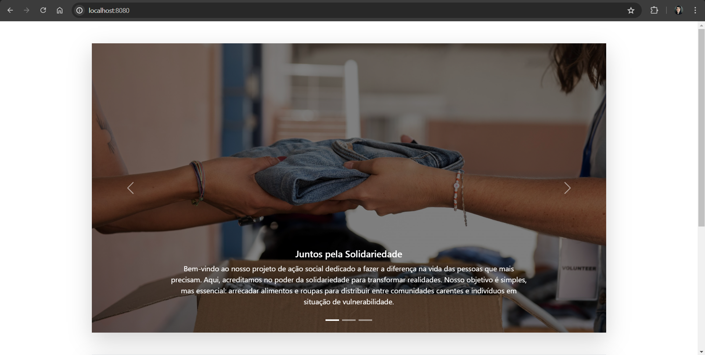
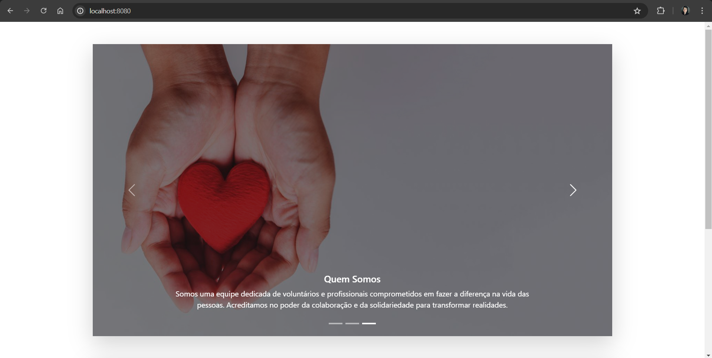
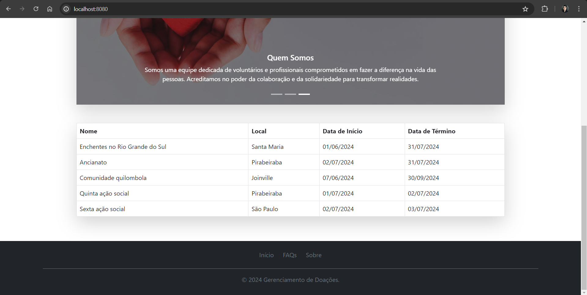
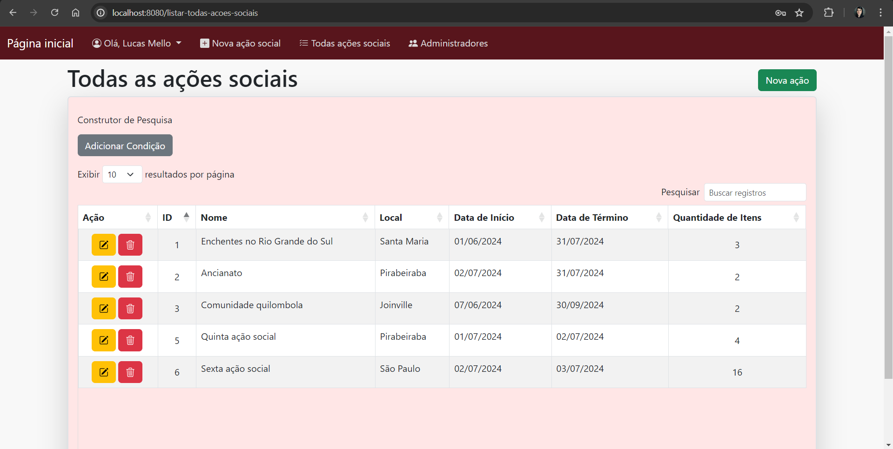
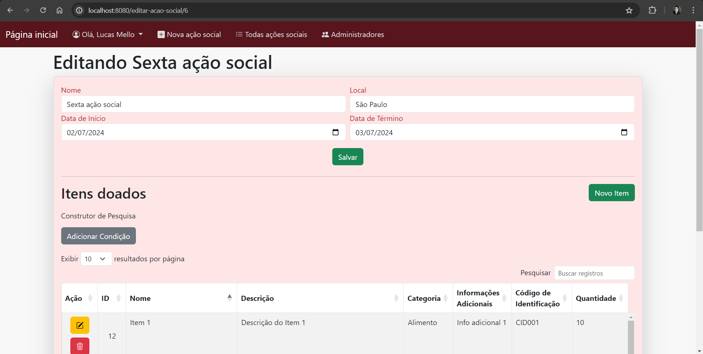
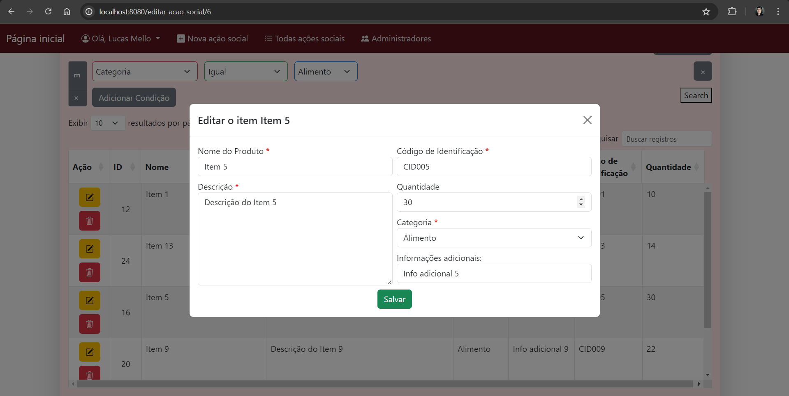
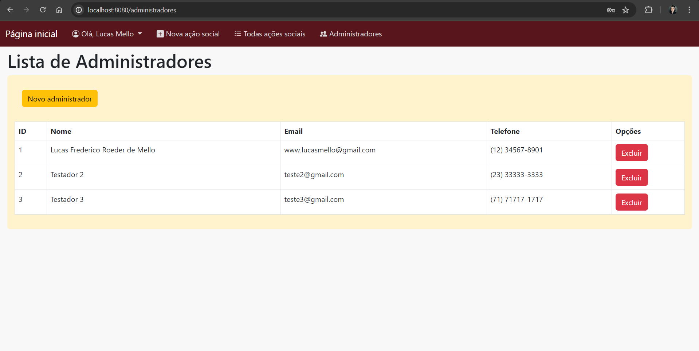

# Vivências de Extensão V

## Projeto para a comunidade Jovens MJEC, desenvolvido por:
- Lucas Frederico Roeder de Mello
- Daslan Mateus Alves de Mesquita
- Lueslen Machado da Silva
- Rafael Gustavo Reinert
- Gabriel Batista da Rocha
- Vitor Antonio Bonin Sebold
- Jandir Martins Neto

Feito em Java com Spring Boot, Thymeleaf, JPA Hibernate, Bootstrap e banco de dados MySQL, esse sistema é feito para operar internamente, sendo possível um usuário sem acesso conseguir acessar apenas a página inicial que contém o carrossel de apresentação e a lista de todas as ações sociais. No acesso interno para operar, apenas 1 administrador pode criar novos administradores para operarem nesse sistema.

### Demonstrativo de algumas telas desse sistema

1. Tela do público falando sobre a solidariedade

2. Tela do público falando sobre quem somos

3. Tela do público com a exibição de todas as ações socias

4. **Acesso interno:** Lista de todas as ações socias

5. **Acesso interno:** Editar uma ação social

6. **Acesso interno:** Editar um item da ação social

7. **Acesso interno:** Lista dos Administradores

