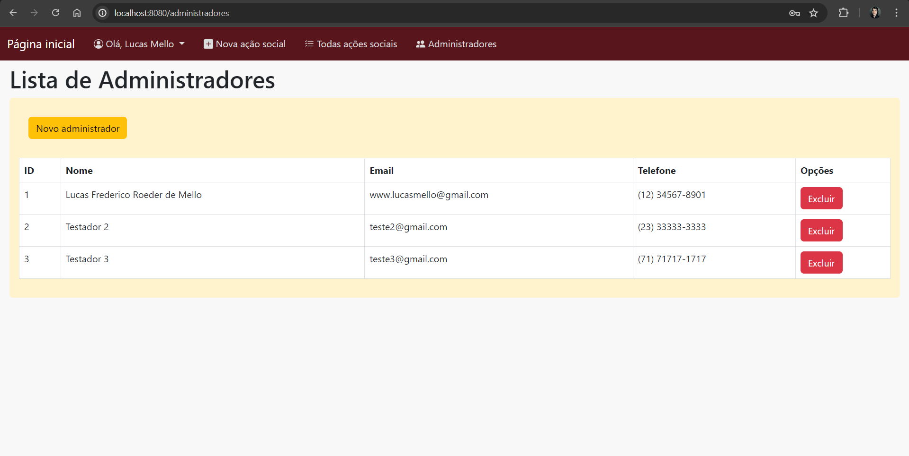

# Vivências de Extensão V

## Projeto para a comunidade Jovens MJEC, desenvolvido por:
- Lucas Frederico Roeder de Mello
- Daslan Mateus Alves de Mesquita
- Lueslen Machado da Silva
- Rafael Gustavo Reinert
- Gabriel Batista da Rocha
- Vitor Antonio Bonin Sebold
- Jandir Martins Neto

